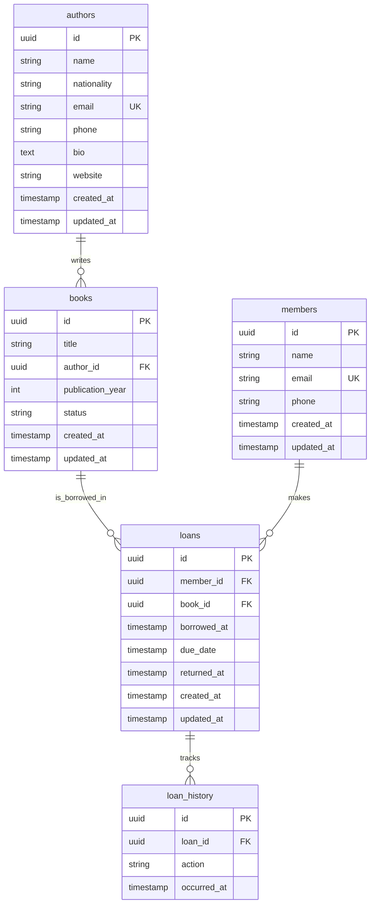

# @root/api

API backend construite avec **Express 5**, **TypeScript** et **Kysely** (query builder SQL pour PostgreSQL).

## Stack technique

- **Runtime** : Node.js (ESM natif)
- **Framework** : Express 5
- **Langage** : TypeScript
- **Base de données** : PostgreSQL via [Kysely](https://kysely.dev/)
- **Validation** : [@vinejs/vine](https://vinejs.dev/)
- **Logs** : Pino / Pino-http
- **Upload de fichiers** : Multer + Sharp (traitement d'images)
- **Stockage** : Flydrive
- **Hot reload en dev** : hot-hook / hot-runner + tsx
- **Lint / format** : Biome
- **Tests de génération de types DB** : kysely-codegen

## Structure du projet

```
apps/api/src/
├── actions/         # Logique métier / cas d'usage (use cases)
├── config/          # Fichiers de configuration de l'application
├── database/
│   ├── factories/   # Factories pour la génération de données
│   └── seeds/       # Scripts de seed de la base de données
├── enums/           # Enumérations partagées dans le projet
├── helpers/         # Fonctions utilitaires réutilisables
├── middlewares/      # Middlewares Express (auth, erreurs, logs...)
├── repositories/     # Accès aux données (couche de persistance)
├── types/           # Types TypeScript partagés (dont db.ts généré)
├── validators/       # Schémas de validation des entrées (Vine)
├── routes.ts         # Déclaration des routes de l'API
└── server.ts         # Point d'entrée du serveur Express
```

### Description des dossiers

| Dossier         | Rôle                                                                 |
|-----------------|-----------------------------------------------------------------------|
| `actions`       | Contient la logique métier isolée, appelée depuis les routes/contrôleurs |
| `config`        | Configuration de l'app (env, base de données, services externes...)   |
| `database`      | Migrations, factories et seeds pour peupler la base de données        |
| `enums`         | Constantes typées utilisées dans tout le projet                       |
| `helpers`       | Fonctions transverses (formatage, calculs, etc.)                      |
| `middlewares`   | Middlewares Express (gestion des erreurs, authentification, etc.)     |
| `repositories`  | Requêtes et interactions avec la base de données via Kysely           |
| `types`         | Types TypeScript, y compris ceux générés automatiquement depuis la DB |
| `validators`    | Schémas de validation des requêtes entrantes                          |

## Alias d'imports

Le projet utilise les **subpath imports** natifs de Node.js (`imports` dans `package.json`) pour simplifier les chemins :

| Alias                    | Chemin réel                     |
|---------------------------|----------------------------------|
| `#config/*`               | `./src/config/*`                 |
| `#router/*`                | `./src/router/*`                 |
| `#controllers/*`           | `./src/controllers/*`            |
| `#actions/*`               | `./src/actions/*`                |
| `#models/*`                | `./src/models/*`                 |
| `#types/*`                 | `./src/types/*`                  |
| `#repositories/*`          | `./src/repositories/*`           |
| `#enums/*`                 | `./src/enums/*`                  |
| `#validators/*`            | `./src/validators/*`             |
| `#helpers/*`                | `./src/helpers/*`                |
| `#middlewares/*`            | `./src/middlewares/*`            |
| `#database/factories/*`     | `./src/database/factories/*`     |

Ces alias basculent automatiquement entre les sources TypeScript (`development`) et le build compilé (`dist`, en production).

## Installation

```bash
pnpm install
```

## Scripts disponibles

| Commande             | Description                                                        |
|----------------------|---------------------------------------------------------------------|
| `pnpm dev`           | Démarre le serveur en mode développement avec hot reload            |
| `pnpm build`         | Compile le projet TypeScript (`tsconfig.build.json`)                |
| `pnpm start`         | Démarre le serveur compilé en production                            |
| `pnpm typecheck`     | Vérifie les types sans générer de build                             |
| `pnpm lint`          | Vérifie le code avec Biome                                          |
| `pnpm format`        | Formate le code avec Biome                                          |
| `pnpm db:migration`  | Crée une nouvelle migration Kysely                                  |
| `pnpm db:migrate`    | Applique les migrations sur la base de données                      |
| `pnpm db:rollback`   | Annule la dernière migration                                        |
| `pnpm db:generate`   | Génère les types TypeScript à partir du schéma PostgreSQL           |
| `pnpm db:seed`       | Exécute le script de seed de la base de données                     |
| `pnpm db:sync`       | Enchaîne migration + génération des types + seed                    |

## Base de données

Le projet utilise **PostgreSQL** avec **Kysely** comme query builder typé. Les types de la base sont générés automatiquement dans `src/types/db.ts` via `kysely-codegen`, garantissant une cohérence stricte entre le schéma SQL et le code TypeScript.

Workflow typique pour la base de données :

```bash
pnpm db:migration   # Créer une migration
pnpm db:migrate      # Appliquer les migrations
pnpm db:generate     # Régénérer les types
pnpm db:seed         # Peupler la base avec des données de test
```

## Environnement

Le projet utilise `dotenv` pour la gestion des variables d'environnement. Créez un fichier `.env` à la racine du monorepo en vous basant sur un éventuel `.env.example`.

## Choix techniques

### Pattern Action : encapsuler la logique métier sans controller

J'ai choisi un pattern Action pour encapsuler la logique métier sans controller séparé. L'idée est simple : plutôt qu'un controller Express classique qui délègue à un service, une seule classe porte à la fois la route, la validation, le traitement métier et la réponse HTTP.

```typescript
import type { Request, Response } from 'express';
import { BaseAction } from '#actions/base_action';
import { Get } from '#config/decorators';
import { Book } from '#repositories/book_repository';

@Get('/books/:id')
export default class ShowBook extends BaseAction {
  async asController(req: Request<{ id: string }>, res: Response) {
    const book = await this.handle(req.params.id);
    if (!book) {
      return res.status(404).json({ message: 'Book not found' });
    }
    return book;
  }

  async handle(id: string) {
    return await Book.findWithAuthor(id);
  }
}
```

Le principe :

- Le décorateur `@Get('/books/:id')` attache les métadonnées de route (méthode HTTP, chemin) directement sur la classe, plutôt que dans un fichier de routing séparé. La route et l'action qui la traite vivent au même endroit.
- `handle` porte le traitement métier pur : il ne connaît ni `req`, ni `res`. Il prend des arguments simples et retourne une donnée. Ça le rend appelable indépendamment du contexte HTTP, par exemple depuis un script de seed, un job, ou un test unitaire, sans avoir à mocker Express.
- `asController` fait le pont entre HTTP et métier : il extrait les paramètres de la requête, appelle `handle`, et adapte le résultat en réponse (ici un 404 si le livre n'existe pas). C'est la seule couche qui connaît Express.
- `BaseAction` (la classe mère) fournit le socle commun : validation automatique via `validator` si elle est définie, exécution de `asController`, et sérialisation JSON du retour sans avoir à écrire `res.json()` dans chaque action.

L'intérêt par rapport à un couple controller/service classique : chaque cas d'usage (afficher un livre, créer un livre, etc.) devient une unité autonome, avec un seul fichier à ouvrir pour comprendre tout le cycle de vie d'une requête. Ça évite aussi la dérive classique des controllers qui grossissent avec dix méthodes différentes, puisqu'ici une action = une route = une responsabilité.

### Hot-hook et routing par imports dynamiques

Aussi j'ai utilisé hot-hook, qui oblige à avoir des imports dynamiques et donc à changer l'API de certaines fonctionnalités d'Express pour l'adapter.

hot-hook permet de recharger à chaud un module (une action) sans relancer tout le serveur Node, mais seulement si le module est chargé via un import() dynamique plutôt qu'un import statique en haut de fichier. Or la manière classique d'enregistrer des routes Express (app.get('/books/:id', handler)) suppose que le handler soit déjà résolu au moment où le fichier de routing s'exécute, donc importé statiquement. Il a donc fallu construire un petit adaptateur.

```typescript
import type { IRouter, RequestHandler } from 'express';
import type { BaseAction } from '#actions/base_action';
import { pinoConfig } from '#config/logger';
import { ROUTE_META } from './decorators.ts';

type ActionLoader = () => Promise<{ default: typeof BaseAction }>;

export async function loadRoute(
  router: IRouter,
  loader: ActionLoader,
  middlewares: RequestHandler[] = [],
) {
  try {
    const { default: action } = await loader();
    const meta = ROUTE_META.get(action);
    if (!meta) {
      throw new Error(`${action.name} has no route metadata`);
    }

    //@ts-expect-error dynamic method access
    router[meta.method](meta.path, ...middlewares, action.handleController());
  } catch (error) {
    pinoConfig.error({ error });
  }
}
```

Ce que fait `loadRoute` :

- Elle prend en paramètre un `loader`, c'est-à-dire une fonction `() => import('#actions/...')` et non l'import direct. C'est ce délai qui permet à hot-hook de suivre le module et de le recharger indépendamment du reste du serveur.
- Une fois le module résolu, elle va chercher les métadonnées de route (`method`, `path`) posées par le décorateur `@Get(...)` sur la classe, via la map `ROUTE_META`.
- Elle enregistre ensuite dynamiquement la route sur le router Express (`router[meta.method](meta.path, ...)`), avec les middlewares optionnels passés en paramètre, et branche `action.handleController()` comme handler final.

Et l'enregistrement des routes ressemble à ceci :

```typescript
export async function registerRoutes(app: Express) {
  const api = Router();

  /** Books */
  await loadRoute(api, () => import('#actions/books/get_paginated_book'));
  await loadRoute(api, () => import('#actions/books/show_book'));
  await loadRoute(api, () => import('#actions/books/store_book'), [ensureJson]);
  await loadRoute(api, () => import('#actions/books/update_book'), [ensureJson]);
  await loadRoute(api, () => import('#actions/books/destroy_book'));

  app.use('/api/v1', api);
}
```

## Schéma de base de données



Le modèle repose sur cinq tables, toutes identifiées par un `uuid` en clé primaire :

## Déploiement

Déploiement sur **AWS Lambda en mode container** (image Docker), via **AWS SAM** et un pipeline **GitHub Actions** déclenché sur push `main`.

- Job `migrate` : applique les migrations Kysely sur la base Neon avant le déploiement.
- Job `deploy` : auth AWS via **OIDC**, push de l'image sur **ECR Public**, puis `sam build` + `sam deploy` de la stack `library-api`.

